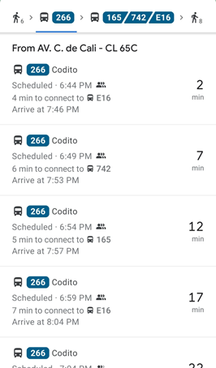

# Transportari
## Integrantes
| Nombres | Github |
|---|---|
| Leidy Marcela Ducuara | [Link](https://github.com/LeidyDucuara) |
| Juan Camilo Gil | [Link](https://github.com/Juank544) |
| Juan Sebastián Caceres | [link](https://github.com/sroll835) |

---

## Resumen

Transportari es una aplicación de movilidad que nos permite cononcer las rutas del Sistema Integrado de Transporte 
Público y saber en tiempo real la ubicación de la ruta que necesitamos específicamente, también podremos conocer que 
tan solicitada es la ruta y así planear los tiempos de viaje que tendrá el usuario.

## Descripción

Esta idea se enfoca en mejorar los viajes en el transporte público, de manera que se tenga un mejor manejo en los 
tiempos y la gestión de los recursos que se disponen, en este caso los buses de SITP y Transmilenio.

## Problema que se resuelve

Este sistema es muy impredecible la hora a la que puede pasar un bus, donde las personas pierden tiempo por una mala 
gestión de los recursos, Google nos ofrece unos intervalos de tiempo, pero no son muy precisos y el nombre de las rutas 
no están actualizadas.

Teniendo la posición actual de los buses las personas mejoran la gestión de su tiempo. 

## Alcance

- La idea se propone para un alcance local, donde los capitalinos puedan disfrutar de un mejor servicio de transporte 
público.

- El real time se evidencia en la posición real del bus para poder escoger la mejor ruta.

## Historias de Usuario